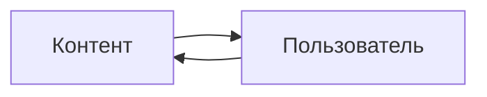

# Моя курсовая работа про создание сервиса briene

<div class="article-publication-date">
    <time datetime="2022-06-03 19:33">03.06.2022 19:33</time>
</div>

В настоящее время есть большой спрос на создание личного бренда и блога для продвижения себя на рынке труда или «для души». Компании же всё чаще пользуются услугами копирайтеров и SMM, чтобы наладить контакт с аудиторией путём создания аккаунтов в социальных сетях, специализированных изданий и блогов. 

> [Google Тренды с анализом тенденций](https://trends.google.ru/trends/explore?date=all&q=%D0%BB%D0%B8%D1%87%D0%BD%D1%8B%D0%B9%20%D0%B1%D0%BB%D0%BE%D0%B3,%D0%BB%D0%B8%D1%87%D0%BD%D1%8B%D0%B9%20%D0%B1%D1%80%D0%B5%D0%BD%D0%B4,%D0%BA%D0%BE%D1%80%D0%BF%D0%BE%D1%80%D0%B0%D1%82%D0%B8%D0%B2%D0%BD%D1%8B%D0%B9%20%D0%B1%D0%BB%D0%BE%D0%B3,SMM)

**Задача** данной работы – рассказать, зачем сервисы для статей и медиа существуют, какие есть на данный момент и почему я не стал использовать их, а создал свой.

В первую очередь я создал его для себя. У меня в том числе присутствует желание заявлять о себе в медиа-пространстве. Для этих целей можно использовать страницу ВКонтакте, сториз в Инстаграм или завести канал в Телеграме. Я перепробовал все эти варианты и в какой-то момент мне стало этого не хватать - не было нужной функциональности, чтобы эффективно донести мысль. Поэтому я решил создать свой сервис для статей и медиа.

Если отойти от высокой цели самореализации и говорить во всеуслышание, то платформа предоставляет возможность *публиковать статьи*. А это уже открывает простор для манёвров - `briene` может быть тем самым медиаресурсом, например, как [Нож](https://knife.media/) или [The Village](https://www.the-village.ru/), движком для личного блога. А ещё здесь можно публиковать научные и образовательные статьи, заметки, учебные конспекты и курсовые (как этот текст).



Ключевой особенностью медиа-платформы, социальной сети – любого публичного пространства – является замкнутый круг «Контент-Пользователь». Это означает, что если на платформе мало авторов и, как следствие, мало контента, то будет мало пользователей-читателей – читатель скажет, что тут *нечего* читать. А если мало читателей, то у авторов нет желания приходить на эту платформу - автор скажет, что тут *некому* читать. Чтобы сервис стал успешным, он должен привлечь определённое число пользователей, которое уже после будет расти как снежный ком. Этот эффект известен как [эффект критической массы](https://books.google.ru/books?hl=ru&lr=&id=14nA7_k05NsC&oi=fnd&pg=PR1&dq=critical+mass&ots=6AaJewVaU0&sig=5aG40-F_zkPG8IulIAvlWIFxax0&redir_esc=y#v=onepage&q=critical%20mass&f=false).

Если это замкнутый круг, то как существующие платформы из него выбрались? Предлагаю рассмотреть магазины видеоигр и попытки Epic Games Store закрепиться на нём. Сейчас на рынке есть небольшое число сервисов, к которым игроки привыкли и уход от которых крайне труден: есть Steam для ПК, Microsoft Store для консолей Xbox и PlayStation Store для консолей PlayStation. Нам интересен рынок ПК, где абсолютным [лидером является Steam](https://comparecamp.com/steam-statistics/). Поэтому Epic Games [приходится вкладывать](https://www.protocol.com/bulletins/epic-store-catching-up-steam) очень много сил (и денег), чтобы привлечь ту самую критическую массу, которая запустит сетевой эффект и бурный рост, который поможет составить конкуренцию Steam.

> Marwell G., Oliver P. The critical mass in collective action. – Cambridge University Press, 1993.

> Katz M. L., Shapiro C. Systems competition and network effects //Journal of economic perspectives. – 1994. – Т. 8. – №. 2. – С. 93-115.

## ГЛАВА 1. Анализ платформ для публикации медиа-материалов

### Критерии сравнения существующих платформ

Для сравнения платформ, которые работают с текстом и медиа-материалами, я определил критерии, которые (по моему мнению) являются *ключевыми* для увеличения аудитории сервиса.

- **Популярность**. Чтобы сервис стал более популярным, он должен быть хотя бы известным. На отобранных сервисах я читаю сам, слежу за местными авторами, а также вижу их в закладках своих друзей. Конечно, можно было расширить список, включив более популярные сервисы - например, Facebook - но среди своего окружения я их не встречал.

- **Редактор**. Крайне субъективный, но очень важный для автора, критерий. Если сервис предоставляет очень громоздкий интерфейс или есть иные сложности для создания контента (как [RuTube, например, где скудный видео-редактор и ручная модерации](https://www.gazeta.ru/tech/2021/04/02/13544858/rutube_future.shtml)), то платформа будет страдать от нехватки контента. Чтобы постараться быть более объективным, при сравнении платформ больше внимания я уделял функциональности редактора.

- **Удобство чтения**. Помимо контента читателей и зрителей привлекает комфорт потребления контента. При этом зачастую комфорт ставится выше самого контента. В этом можно убедиться, посмотрев на [резюме фронтенд-разработчицы](https://ariarzer.dev/resume.html) - так и хочется подключить таблицы стилей, чтобы было приятнее читать.

- **Платные возможности для авторов**. Авторы приходят на платформы не просто так, а чтобы заработать. Для них крайне важно создать такую систему получения дохода с контента, которая впишется в их существующую. Например, платный доступ к статьям, система донатов и пожертвований, авторские отчисления.

### Платформы

- **ВКонтакте**. Детище Павла Дурова предлагает два способа создания текстового контента: обычный пост и полноценная статья. Эти форматы по-разному выглядят, создаются и воспринимаются алгоритмами рекомендаций. В своём сравнении я буду опираться на полноценные статьи, т.к. посты совсем уж скудные по функциональности на сегодняшний день. Примеры: [пост-интервью с руководителем UX-разработки Yandex Cloud](https://vk.com/yandex4developers?w=wall-17796776_11539) и [статья Яндекса о культуре эксперимента](https://vk.com/@yandex4developers-kultura-eksperimenta). 

- **Telegram**. Как и у ВКонтакте, у Telegram есть два способа создания контента: сообщение (личное сообщение или пост в канале) и статья в Telegraph. Последний - фактически отдельный сервис, но тесно интегрирован в мессенджер - просмотр статьи доступен без перехода в отдельное приложение, а для написания статей доступен бот внутри мессенджера. Примеры: [пост про AlphaCode](https://t.me/ctodaily/1476) и [статья Павла Дурова про комиссию AppStore](https://telegra.ph/7-mifov-kotorye-ispolzuet-Apple-dlya-obosnovaniya-30-nogo-naloga-na-prilozheniya-07-28-2).

- **Хабр**. Хабр имеет несколько подразделов: сам Хабр, Q&A, Карьера и Фриланс. Нас интересует медиа пространство - традиционный [Хабр](http://habr.com/). Платформа позиционирует себя как «Сообщество IT-специалистов» - все статьи так или иначе рассказывают об «IT-тусовке».

- **Платформы «Комитета»: VC.ru, DTF, TJ**. Комитет как издательский дом разработал платформу для блогов - Osnova. На ней работают проекты VC.ru, DTF и TJ. [VC.ru](https://vc.ru/) позиционирует себя как платформа для предпринимателей и специалистов, [DTF](https://dtf.ru/) - для обсуждения произведений развлекательной индустрии, [TJ](https://tjournal.ru/) - платформа для новостей в России и мире.

- **Medium**. [Платформа](https://medium.com/) примерно обо всём. При этом сервис сам выступает как готовая платформа для авторов, а также предоставляет средства для создания своих собственных пространств. Например, [Towards Data Science](https://towardsdatascience.com/) - пространство внутри платформы.

### Сравнение

Для всех редакторов справедливо:
- Поддерживаются:
  - Заголовки до 2 уровня.
  - Модификации шрифта - жирный, курсив и т.п.
  - Списки нумерованные и ненумерованные.
  - Текстовые блоки с разделителями.
  - Блоки с цитированием. У всех выглядят по-разному, но смысл одинаковый.
- Удобство:
  - Комфортная ширина контента.

В таблице приведены только отличительные черты.

|Характеристика|ВКонтакте|Telegram (Telegraph)|Хабр|Комитет|Medium|
|-|-|-|-|-|-|
|Популярность (млн/месяц)|73|500|33|15|100|
|Редактор|- Мультимедиа (фото, видео, музыка, GIF) <br> - Опросы <br> - Товары|- Мультимедиа (фото; видео, твиты по ссылке)| - Мультимедиа (фото; видео, твиты, музыка по ссылке) <br> - Опросы (в конце статьи) <br> - Формулы (в формате Tex) <br> - Скрываемый текстовый блок <br> - Редактор таблиц <br> - Якорные ссылки <br> - Листинги с кодом <br> - Теги|- Мультимедиа (загружаемые фото, видео, аудио) <br> - Опросы <br> - Якорные ссылки <br> - Листинги с кодом <br> - Теги <br> Предпросмотр материала|- Мультимедиа (загружаемое фото, фото из Unspash, видео, встроенное медиа как YouTube или SoundCloud) <br> - Теги <br> - Приватные заметки|
|Удобство чтения|Плюсы: ночной режим, просмотр фото на весь экран. Минусы: статья заканчивается рекомендациями других статей.|Плюсы: минималистичный просмотр. Минусы: нет просмотра фото во весь экран.|Плюсы: есть просмотр фото во весь экран. возможности комментирования. Минусы: контент сильно смещён влево, фиксированный блок с рекомендациями.|Плюсы: есть просмотр фото во весь экран, возможности комментирования.|Плюсы: есть просмотр фото во весь экран, заметки в тексте статьи. Минусы: контент сильно смещён влево, фиксированный блок с рекомендациями, статья заканчивается рекомендациями.|
|Платные возможности для авторов|Для статей нет, донаты для групп.|Для статей нет, донаты для каналов.|Нет.|Для статей нет, донаты для авторов.|Членство в Medium - часть стоимости отчисляется автору.|
|Дополнительно||Тесная интеграция с клиентом Telegram|Мегапосты, система рейтинга (кармы)|Система рейтинга|Подписка на автора по электронной почте|

Источники с данными об аудитории:

> [Пресс-релиз ВК](https://vk.company/ru/press/releases/11114/)

> [ВК подвел итоги первого квартала 2022 года](https://rozetked.me/news/23263-vkontakte-podvela-itogi-pervogo-kvartala-2022-goda)

> [Аудитория Telegram превысила 500 млн пользователей в месяц — это на 100 млн больше, чем в апреле 2020 года](https://vc.ru/social/195967-auditoriya-telegram-prevysila-500-mln-polzovateley-v-mesyac-eto-na-100-mln-bolshe-chem-v-aprele-2020-goda)

> [Исследование площадок для публикации статей IT-тематики (русскоязычных и мульти-язычных)](https://vc.ru/flood/34661-issledovanie-ploshchadok-dlya-publikacii-statey-it-tematiki-russkoyazychnyh-i-multi-yazychnyh)

> [Медиакит «Комитета»](https://docs.google.com/presentation/d/1zzArmiPgrhLLNUvG8XR6hgQu5U9CT0xZ0JmjoAmG7xg/edit#slide=id.p3)

> [Статистика 7 Медиа-Платформ](https://medium.com/blogging-guide/7-amazing-medium-platform-statistics-688986c518bd)

Лично я бы расположил платформы в следующем порядке:
1. **Комитет**. Крайне гибкая и дружелюбная для пользователя система, а самоорганизация в виде рейтинга позволяет прозрачным и естественным образом продвигать контент.
2. **ВКонтакте**. Акцент - на контенте, но статьи теряются из-за работы алгоритмов рекомендаций.
3. **Хабр**. Гибкая и дружелюбная система с хорошей системой рейтингов, но не ценит читателя. Боковая панель рекомендаций перетягивает на себя внимание и подталкивает уйти из статьи.
4. **Telegraph**. Минимализм, перетекающий в бедность. Сам по себе Telegram не имеет систему рекомендаций – это просто мессенджер. Более того, Telegraph – сервис для написания и просмотра статей. По функциональности это больше редактор, чем медиа-платформа.
5. **Medium**. Удобная платформа, но не ценит читателя. Очень часто при открытии статьи появляется платёжное окно (paywall), которое не даёт прочитать статью, из-за чего возникает вопрос «а так ли мне хочется прочитать, чтобы за это платить?».

## ГЛАВА 2. Разработка платформы

Итак, мы разобрались с существующими платформами, определили ориентиры ~~для копирования~~, референсы, определили слабые места, которые стоит избегать. Можно приступать к написанию своей платформы.

### Формат
Первым делом надо определить, как авторы будут создавать контент. Я остановился на формате **Markdown**. Этот формат особенно популярен среди разработчиков, т.к. позволяет написать что угодно, не отрываясь от клавиатуры. Формат интегрирован в редакторы систем контроля версий (GitLab и GitHub), трекеры задач (Jira) и средства повышения продуктивности (например, [Obsidian](https://obsidian.md/)). Подробнее про формат можно прочитать здесь: [справочник Дока о Markdown](https://doka.guide/tools/markdown/).

Сам по себе синтаксис Markdown невыразителен и скучен:

```
### Формат
Первым делом надо определить, как авторы будут создавать контент. Я остановился
на формате **Markdown**. Этот формат особенно популярен среди разработчиков, т.к. позволяет 
написать что угодно, не отрываясь от клавиатуры. Формат интегрирован в редакторы систем 
контроля версий (GitLab и GitHub), трекеры задач (Jira) и средства повышения продуктивности 
(например, [Obsidian](https://obsidian.md/)). Подробнее про формат можно прочитать здесь: 
[справочник Дока о Markdown](https://doka.guide/tools/markdown/).
```

Чтобы его было комфортно читать, он переводится в HTML-код и вставляется на страницу. С этим мне помогает [библиотека Vue Markdown Editor](https://github.com/code-farmer-i/vue-markdown-editor). 

Т.к. синтаксис переводится в HTML, то можно сразу писать в нём - редактор при трансляции просто пропустит этот фрагмент:

```
<div style="text-align:right">
Это текст, который будет "липнуть" к правому краю
<br><br>
</div>
```

<div style="text-align:right">
Это текст, который будет "липнуть" к правому краю
<br><br>
</div>

Таким образом, Markdown легко пользоваться и он позволяет «писать красиво из коробки». Поэтому вокруг него я и решил построить редактор статей. Получилось так, что *авторам просто писать, а читателям – приятно читать*.

### Основная функциональность

Мы разобрались, как писать на платформе. Теперь посмотрим, что она умеет и как этим пользоваться.

#### Публикация статей
Любую статью можно опубликовать в двух режимах: *черновик* и *публикация*. Черновики может просматривать и редактировать только их автор. Публикации же доступны только всем, но только для чтения. 


<center><i>Редактор позволяет сохранить черновик и создать публикацию</i></center>
<br>
<br>

После нажатия любой из этих кнопок будет предложено задать краткое описание статьи (Summary) и проставить теги, чтобы читатели быстрее нашли Вашу статью.


<center><i>Краткое описание и теги</i></center>
<br>
<br>

После публикации статью можно найти на странице со свежими статьями.


<center><i>Так выглядят опубликованные статьи</i></center>
<br>
<br>

Карточка содержит самую базовую информацию о статье: автор, название, дата публикации, теги и краткое описание.


<center><i>А так выглядят мои черновики</i></center>
<br>
<br>

Черновики тоже представлены в виде карточек, но рядом с автором отмечен тип статьи - черновик или публикация. В контекстном меню доступны быстрые действия: редактировать статью и удалить.

#### Управление закладками
Пользователь может добавить опубликованную статью в закладки, нажав на иконку закладки. Список закладок доступен из личного кабинета пользователя в соответствующем разделе.


<center><i>Как добавить статью в закладки</i></center>
<br>
<br>


<center><i>Список моих закладок</i></center>
<br>
<br>

#### Цитирование статьи
Читатель может выделить фрагмент статьи и превратить его в цитату. Цитата выглядит как специальный код, который ссылается на выделенный фрагмент.

Вот так создаётся цитата:


<center><i>Выделенный текст может стать цитатой</i></center>
<br>
<br>

Так она выглядит для читателя:

>контекст важнее факта.
>
><p>- <a target="_blank" href="https://briene.herokuapp.com/articles/9aaa88eb-9042-4eaa-b818-bb4472d4d144/#:~:text=%D0%BA%D0%BE%D0%BD%D1%82%D0%B5%D0%BA%D1%81%D1%82%20%D0%B2%D0%B0%D0%B6%D0%BD%D0%B5%D0%B5%20%D1%84%D0%B0%D0%BA%D1%82%D0%B0."><i>Контекст</i></a></p>

А вот так она выглядит для автора:

```
>контекст важнее факта.
>
><p>- <a target="_blank" href="https://briene.herokuapp.com/articles/9aaa88eb-9042-4eaa-b818-bb4472d4d144/#:~:text=%D0%BA%D0%BE%D0%BD%D1%82%D0%B5%D0%BA%D1%81%D1%82%20%D0%B2%D0%B0%D0%B6%D0%BD%D0%B5%D0%B5%20%D1%84%D0%B0%D0%BA%D1%82%D0%B0."><i>Контекст</i></a></p>
```

#### Панель администратора
Чтобы попасть в панель администратора, надо перейти в личный кабинет и, если Вы - администратор - нажать на ссылку Admin.


<center><i>Личный кабинет и вход в панель администратора</i></center>
<br>
<br>

Администратор может управлять пользователями – менять их роли: «заблокирован», «пользователь» «администратор». Также он может видеть, редактировать и удалять все статьи.


<center><i>Панель администратора</i></center>
<br>
<br>

#### Поиск

В верхней части страницы сервиса всегда есть строка поиска. Благодаря ей можно получить список статей, которые будут содержать набранный запрос.


<center><i>Строка поиска</i></center>
<br>
<br>

Ответом поиска будет список релевантных статей, который можно просматривать постранично. Про технологии поиска будет рассказано в следующем разделе.


<center><i>Результаты поиска</i></center>
<br>
<br>

### Реализация

Мы разобрались, как создавать статьи, что с ними можно делать и что можно делать в сервисе в принципе. Дело осталось за малым - сделать сам сервис.

#### Бэкенд

1. **Spring** - бэкенд-фреймворк. Я выбрал этот фреймворк, т.к. в нём у меня больше всего компетенции. А ещё по этому фреймворку очень много документации и готовых лучших практик.
2. **PostgreSQL** - хранилище данных. Было выбрано по той же причине, что и фреймворк.
3. **JSON Web Token** - подход к авторизации пользователей. При данном подходе у каждого пользователя есть уникальная строка, которая называется *токен*. Эта строка хранится у пользователя в браузере и у платформы на сервере. Когда пользователь входит в свою учётную запись на сайте в первый раз, то создаётся новый токен и отправляется пользователю и серверу. В следующий раз, когда пользователь зайдёт на сайт, то он предъявит свой токен, и сервер его узнает.
4. **Bonsai** - поиск. [Этот инструмент](https://elements.heroku.com/addons/bonsai) - расширение для хостинга Heroku. Построен на базе ElasticSearch и предоставляет инструментарий для полнотекстового поиска, без которого не обойтись в сервисе, где есть текстовые материалы.
5. Прочие инструменты
    - Для сокращения и упрощения кода использовался **Lombok**. Для создания скрипта быстрого запуска и миграции базы данных - **Flyway**. Для проверки сохраняемых сущностей на соответствие требованиям (непустое имя, формат почты, непустой заголовок и т. п.) - **Hibernate Validator** .

#### Фронтенд

1. **Vue** - фронтенд-фреймворк. Главное (во всяком случае для меня) преимущество этого фреймворка - *реактивность*. Это означает, что изменение данных сразу вызывает перерисовку интерфейса без необходимости специального вызова. Это требует, например, React и Flutter, поэтому я не стал их использовать.
2. **Vue markdown editor**. Редактор платформы построен именно на этой библиотеке. Стиль редактора можно настроить как обычными web-средствами с помощью CSS, так и с помощью плагинов. Например, один плагин позволяет установить тему, как у GitHub, другой - добавляет синтаксис для создания формул Katex, третий - синтаксис для создания диаграмм Mermaid.
3. **Bootstrap**. Инструмент позволяет создавать адаптивный интерфейс. Т.е. такой интерфейс, который будет меняться в зависимости от устройства - будь то компьютер, смартфон или планшет. Также этот инструмент предоставил стили для базовых элементов: шрифт, меню, формы.
4. Прочие инструменты
    - **Moment** - форматирование даты. **Axios** - http-клиент, который отправляет запросы на бэкенд. **Vuex** - менеджер состояния пользователя.

#### Диаграммы классов

Небольшая оговорка - все поля всех классов приватные. Для полей сделаны getter\'ы и setter\'ы - методы для получения и проставления полей.

На картинке ниже диаграмма классов для *entities* - сущностей, которые хранятся в базе данных. Центром платформы и диаграммы является *Статья*. У статьи есть *Состояние* типа enum (перечисление констант), где есть три значения - «Опубликована», «Черновик» и «Все». Последнее состояние - программная заглушка для запросов, которые просят показать все статьи. 

У каждой статьи есть Автор - *Пользователь*, который её написал. Пользователь имеет массив из *Ролей*. Роли определяют уровни доступа к функциям платформы и помогают определить, заблокирован пользователь или нет. 

Также Пользователь имеет список статей-закладок. Возникает угроза рекурсии - если запросить статью, то ответом будет статья с автором с закладками, у которых тоже есть авторы и т.д. Чтобы такого не происходило, при запросах отправится только имя автора, т.е. ответ вида *статья + имя автора*.


<center><i>Диаграмма классов для сущностей, которые хранятся в базе данных</i></center>
<br>
<br>

У *Роли* есть программная заглушка в виде *RoleEnum*. Это позволяет не создавать объект каждый раз, а вызывать константу, которая уже имеет готовый объект. Помимо этого, константа содержит служебную информацию: краткое описание роли и действие, приводящее к этому состоянию.

Но сущности - сырой формат данных, который надо преобразовать в лёгкие для браузера объекты - DTO, Data Transfer Objects.


<center><i>Диаграмма классов для ответов</i></center>
<br>
<br>

Ключевым классом является *PageResponseDTO*, который отвечает за постраничные ответы. Это могут быть страницы как со Статьями (*ArticleDTO*), так и с Пользователями (*UserDTO*) - поэтому применяется наследование и генерализация. Например, на главной странице будут показаны страницы со Статьями, а в кабинете Администратора - с Пользователями, но под капотом это всё - один класс.

*SearchResponseDTO* - объект для поисковых ответов. Помимо страниц с релевантными статьями содержит предложения к поиску. 

*AuthorDTO* содержит информацию про автора - имя, описание и страницу со статьями.

*ArticleDTO* хранит только самую необходимую информацию, которая может быть расположена на соответствующей карточке. Этот объект не хранит контент, т.к. если нужно получить список статей, то у всех надо загрузить контент, а он может быть большим и в карточке он не показывается.

Для просмотра статьи контент, разумеется, нужен и поэтому существует класс-потомок *ArticleWithContent*, который, как гласит название, содержит контент. При этом контент в сыром виде - в виде Markdown - т.к. перевод в HTML происходит в браузере.

#### Диаграммы последовательностей

Теперь посмотрим, как происходят некоторые - на мой взгляд самые интересные - процессы.


<center><i>Диаграмма последовательности регистрации пользователя</i></center>
<br>
<br>

*Регистрация пользователя*. Пользователь вводит свои данные, нажимает кнопку Зарегистрироваться (Sign Up), браузер отправляет данные на сервер, чтобы тот сохранил пользователя. В процессе, если пользователь с указанными именем или почтой обнаружены есть в базе, то отправляется ответ с ошибкой. Если пришли новые данные, то пользователь сохраняется с ролью *User* по умолчанию перенаправляется на страницу входа, где использует данные, которые только что ввёл при регистрации.


<center><i>Диаграмма последовательности получения статьи для чтения</i></center>
<br>
<br>

*Получение статьи для просмотра*. Для чтения статьи отправляется запрос без флага `raw`. Этот флаг используется только для вставки текста в редактор. Запрос с флагом raw=true отличается механизмом проверки, может ли пользователь редактировать статью.

Итак, пользователь кликает на ссылку со статьёй. Запрос отправляется на сервер, где происходит поиск статьи. Если нужная статья не найдена, то будет показана страница с ошибкой 404 - «не найдено». Если статья есть, то проверяется, может ли пользователь её смотреть. А смотреть он её может если он администратор (он вправе смотреть любые статьи), автор этой статьи (и это статья-черновик)  или статья опубликована. Если хотя бы одно требование выполнено, то происходит отправка Markdown-контента и рендер статьи в HTML. Иначе будет показана страница «Статья не найдена».

\'<center><i>Диаграмма последовательности получения страницы автора</i></center>
<br>

Для получения информации об авторе и его статьях нужно перейти по ссылке, которая содержит его имя - оно есть в карточке статьи и в её полном виде для чтения. Получение информации осуществляется в два запроса. Первый получает данные автора-пользователя, и, если его нет, перенаправляет на страницу ошибки. Если же автор-пользователь есть, то отправляется второй запрос, который собирает все его опубликованные статьи. В конце всё это агрегируется и отправляется одним ответом на страницу.

Страница с автором поддерживает постраничные запросы. При нажатии на  кнопку «Загрузить больше» (Load more) отправляется запрос, похожий на тот, что описан выше, но с другим смещением. Т.е. если в первом случае было запрошено, например, «5 статей, начиная с 0», то второй будет - «5 статей, начиная с 5-й». Статьи из ответа будут соединены с теми, что уже есть на странице.

## Заключение
В мире постоянно растёт объём информации - становится больше рекламы, советов, книг, новостей. Задача создания систем, способных всё обрабатывать и эффективно доносить до потребителя, является всё более актуальным. При этом важно создать среду, где происходит осознанная работа с информацией, в которой читатель не будет чувствовать себя перегруженным и упускающим что-то. 

В ходе данной работы были рассмотрены мотивы создания платформы для публикации медиа, рассказано про существующие решения, а также показана техническая сторона создания сервиса. При этом есть куда развиваться - исправление ошибок, добавление системы модерации контента, перенос сервиса на более удобный хостинг, внедрение новой функциональности.

## Приложения
1. Исходные файлы: [Github проекта](https://github.com/TomSuworof/briene)
2. Сам сервис: [Briene](https://briene.herokuapp.com/)

> Официальная курсовая, которую я отправил научнику и вузу, отличается более скучной стилизацией, строгостью в выражениях, оформлением по ГОСТу. Эта статья - моя курсовая работа, какой она задумывалась. Почти вся работа была написана в этом же сервисе.
