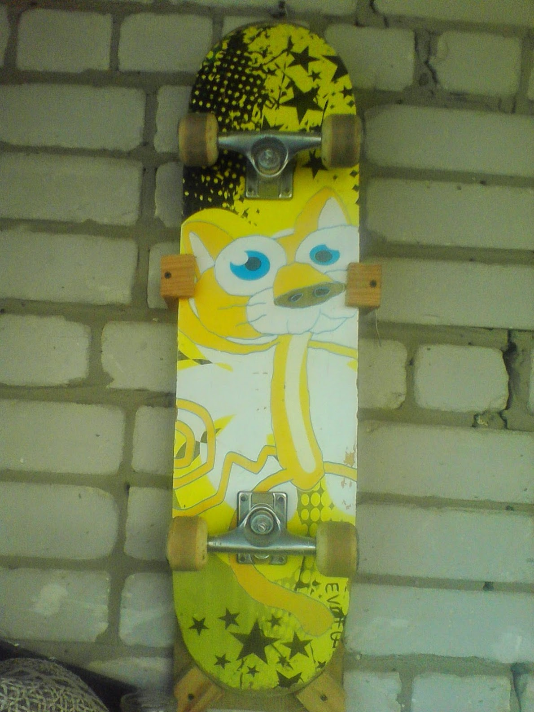

# Выход в реальный мир

    <time datetime="2025-02-02 20:16">02.02.2025 20:16</time>

Очень нравятся механики в играх, основанные на взаимодействии с реальным миром. Когда не только ты хранишь воспоминания об игровом мире, но и игровой мир хранит воспоминания о тебе или влияет на тебя. Собрал парочку примеров.

Детские игры про Скуби-Ду (хотя сам Скуби не детский, но это опустим) предлагают раскраски и рецепты (!) из игры: [видео от Дмитрия Бурдукова.](https://youtu.be/-evyvUDrZOE?si=4RCYyIYgBkhF6wR7)

TEARAWAY на PS Vita использует камеру консоли для отображения игрока как Солнца или для переноса текстуры на персонажей: [видео от Сергея Москвина](https://youtu.be/92KAFKiJlYc?si=jKv0U77yFTdVQcF9&t=150.)

Я посмотрел эти видео, сделал для себя заметку и забыл про это. А тут вспомнил. Оказывается, я ещё в детстве видел такую концепцию. На самом первом смартфоне у меня была игра [True Skate](https://play.google.com/store/apps/details?id=com.trueaxis.trueskate&hl=ru), которая позволяла перенести любое изображение на доску. Так вот в те года у меня был свой скейт! Я сфоткал его, залил изображение и играл дико довольный со своим собственным раскрасом.

Вообще, весь этот спич для того, чтобы вы заценили этого котяру. This is literally me!

