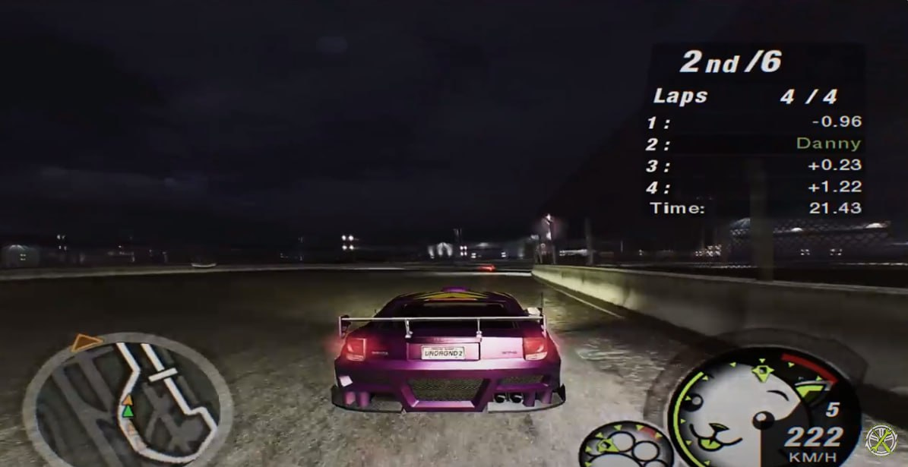
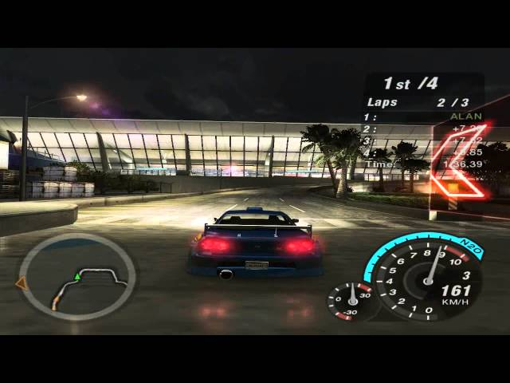
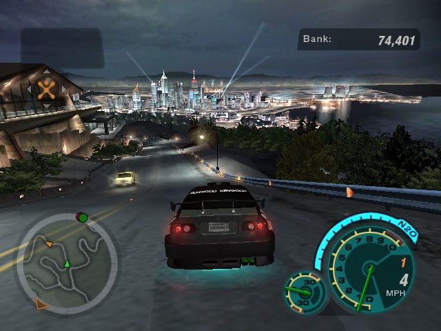
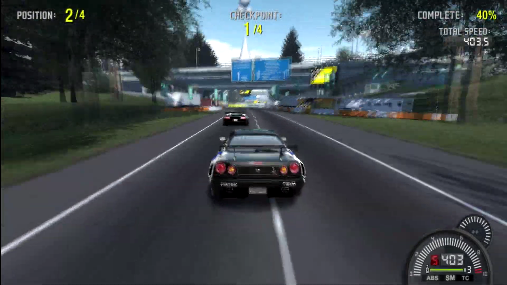
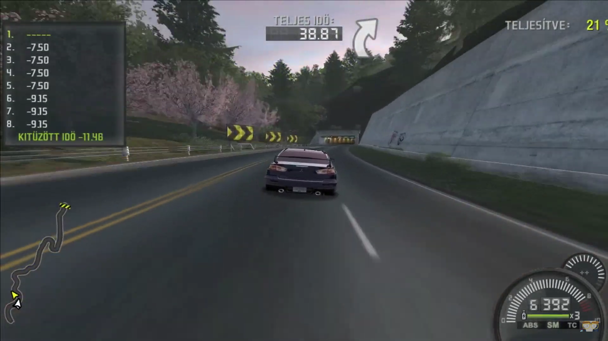
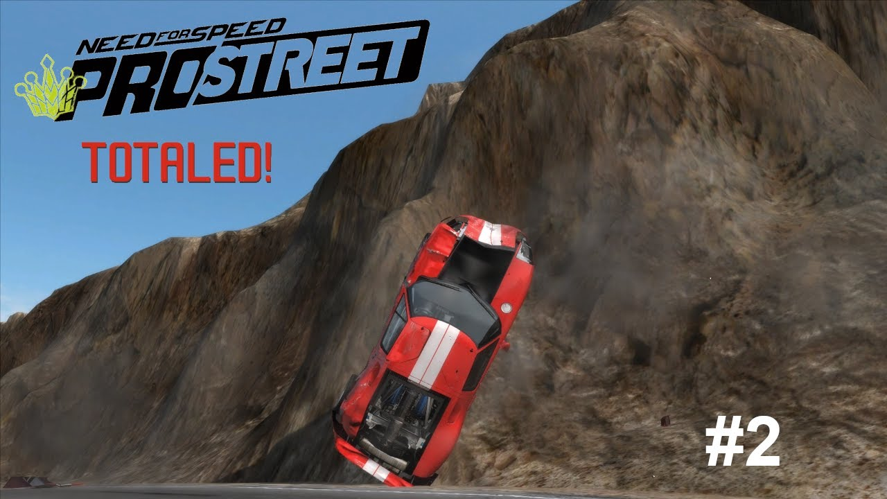
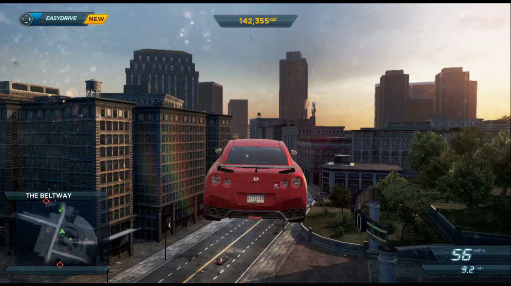
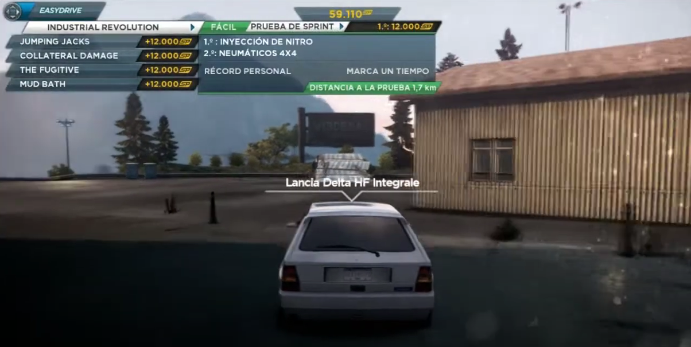
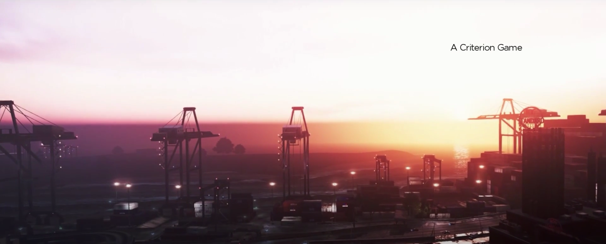

# Как музыка переносит меня в игры

    <time datetime="2024-06-22 23:14">22.06.2024 23:14</time>

Музыки пост.

Как-то так вышло, что в детстве среди всех игр чаще всего я играл в гонки. Конечно же, чаще всего это был NFS. В более зрелом возрасте я решил перепройти, допройти и просто пройти наиболее интересные для меня игры серии. Во-первых, оно того стоило. Во-вторых — боже, какая там музыка… Сегодня про NFS Underground 2, Pro Street и Most Wanted 2012.

# NFS Underground 2

Музыка в первом и второй Подземке идеально описывается так: это то, что пацаны поставили бы себе в магнитолу на кассете.

 

**Helmet — Crashing Foreign Cars**. Играет он во всех заездах, но у меня он ассоциируется с конкретными «легальными» гонками в аэропорту, где нужно выбирать траекторию, точки торможения, выбирать момент для нитро, слипстрим. И это всё в старой аркаде! Сколько боли и счастья в этой песне.

[https://youtu.be/IfiL_xC1ekE?si=3aWd3e8zihpDeBOm](https://youtu.be/IfiL_xC1ekE?si=3aWd3e8zihpDeBOm)

 

**Skindred — Nobody**. Это шоссе, увороты от транспорта и большая скорость. 

[https://youtu.be/WsQhuxPsSjE?si=MTUPRLbJNi-BadWL](https://youtu.be/WsQhuxPsSjE?si=MTUPRLbJNi-BadWL)

 

**Paul van Dyk — Nothing But You (feat. Hemstock & Jennings) (CIrrus Mix)**. Для меня это путешествие по городу между гонками, заезд на время за фотографией. Очень спокойная и мелодичная.

[https://youtu.be/86egBLSDDcE?si=er4KWajdlrtDIzEl](https://youtu.be/86egBLSDDcE?si=er4KWajdlrtDIzEl)

 

# NFS ProStreet

Имхо, в игре самая правильно подобранная музыка. Игровой процесс строится вокруг того, что мы выступаем на фестивалях и добираемся до фестивальных боссов. Это легальные гонки, это зрители, это развлечение. И играет тут в основном музыка для фестивалей, для танцпола. Я даже плейлист собирал: [https://soundcloud.com/tom_suworof/sets/nfs-prostreet](https://soundcloud.com/tom_suworof/sets/nfs-prostreet). Как оказалось, большинство крутых треков играет всего в паре режимов — Speed Challenge и Top Speed Run — зато какие это режимы.

 

**Peaches — Boys Wanna Be Her (Tommie Sunshine's Brooklyn Fire Retouch)**. Спокойная танцевальная музычка, А ТЫ В ЭТО ВРЕМЯ ЛЕТИШЬ СО СКОРОСТЬЮ 400 КМ/Ч, УКЛОНЯЯСЬ ОТ СТОЛБОВ И ОПОР МОСТОВ.

[https://youtu.be/8uzRR-vxZ60?si=9sauWWytxj7nKO4Q](https://youtu.be/8uzRR-vxZ60?si=9sauWWytxj7nKO4Q)

 

**Junkie XL ft. Lauren Rocket — More (Junk O Punk Remix)**. Это классика. У трека несколько десятков исполнений.

[https://youtu.be/ymlof3ZLs20?si=GmsElsUmp4Y9GB3k](https://youtu.be/ymlof3ZLs20?si=GmsElsUmp4Y9GB3k) (видос какой-то неподходящий)

 

**Bloc Party - Prayer (Does It Offend You, Yeah? Remix)**. TOTALED. Опять же, летишь под 400 км/ч по несчастной Неваде на Ford GT, налетаешь на кочку и улетаешь в горы. Тачка в тотал, игровых звуков нет, только этот грустный трек. Это я всё помню, когда мы с братьями играли на его PS2 лет -дцать назад, а оказывается, что это мем.

[https://youtu.be/y1F6WyEtvTA?si=G6vNKKS5vEzpTF-j](https://youtu.be/y1F6WyEtvTA?si=G6vNKKS5vEzpTF-j)

 

# NFS Most Wanted 2012

Игра — результат очень плохого менеджмента со стороны EA. В сети уже достаточно роликов о том, как команда Criterion Games планировала сделать идейное и сюжетное продолжение оригинального MW 2005, однако из-за сроков (каких?) пришлось резать абсолютно всё. Однако музыка… ман, это вышка.

 

**Heaven's Basement — I Am Electric**. Это напряжённая гонка с кучей заносов и трамплинов. Собственно, трек тоже с перепадами настроений.

[https://youtu.be/XjRaKId4Rps?si=nKgj1-zwdYa1lalh](https://youtu.be/XjRaKId4Rps?si=nKgj1-zwdYa1lalh)

 

**The Chemical Brothers — Galvanize**. Побережье, маяк, Лянча Дельта Интеграле Эволюционе. А вообще я не ожидал услышать эту песню.

[https://youtu.be/Xu3FTEmN-eg?si=vKqSqMzZ_kPAUUu8](https://youtu.be/Xu3FTEmN-eg?si=vKqSqMzZ_kPAUUu8)

 

**Muse — Butterflies and Hurricanes**. Это открывающая песня. Это старт игры. Это ожидание. Это YOU’VE GOT TO BE THE BEST, о чём вся идея Чёрного списка в игре. А до этого она была в интро F1 05 — эксклюзив для PS2. Сони и всегда знали толк в хорошей музыке. И это просто лучшая песня.

[https://youtu.be/EzCKrwOme2U?si=Xa4jg8zfnvKFccdo](https://youtu.be/EzCKrwOme2U?si=Xa4jg8zfnvKFccdo)
