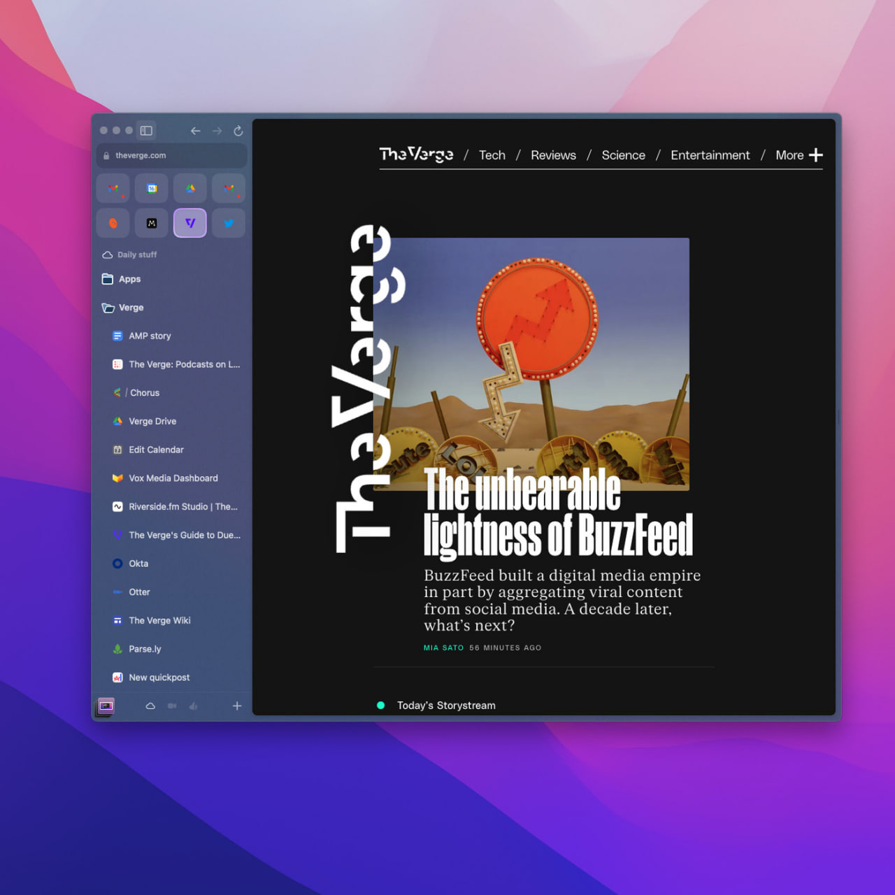
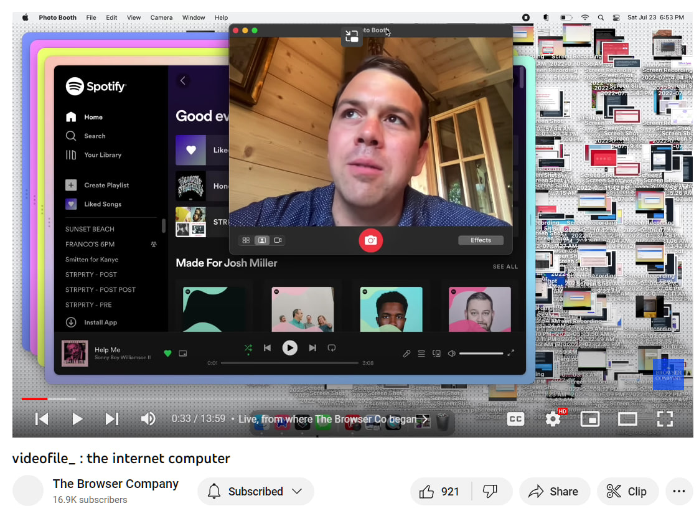

# Открытость

    <time datetime="2023-03-21 19:34">21.03.2023 19:34</time>

Среди браузеров не так давно случилось пополнение. появился некий [Arc](https://arc.net/). но меня интересует на сам браузер, а компания за ним.

Браузерная Компания (да) на [ютубе](https://www.youtube.com/@TheBrowserCompany) делится анонсами, обзорами и реакциями на обзоры. И это — как то, что подкупает.

На втором скрине — чуть ли не самый первый кадр на канале, где СЕО рассказывает про идею Арка. И вот это интересно. СЕО всем показывает, что он простой человек, что вот у него спотифай ("помогите мне!"), вот у него куча файлов и вкладок и вообще он с семьёй только что был. Такое принятие за своего очень сильно сближает с пользователем, позволяет довериться (и доверить свои данные и деньги).

Ещё один неочевидный бонус открытости: она полезна и с точки зрения продуктивности команды: если раструбил на весь мир, что что-то делаешь, то теперь ты должен это сделать (никто никому ничего не должен, но вы поняли).