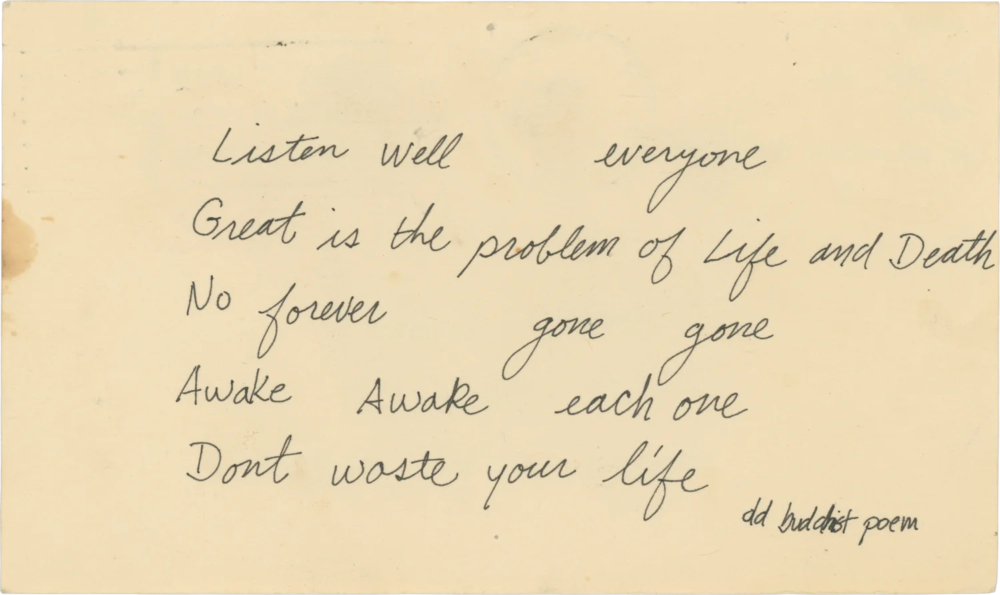
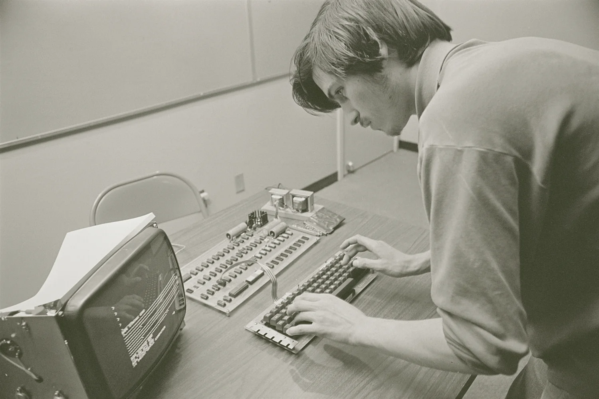
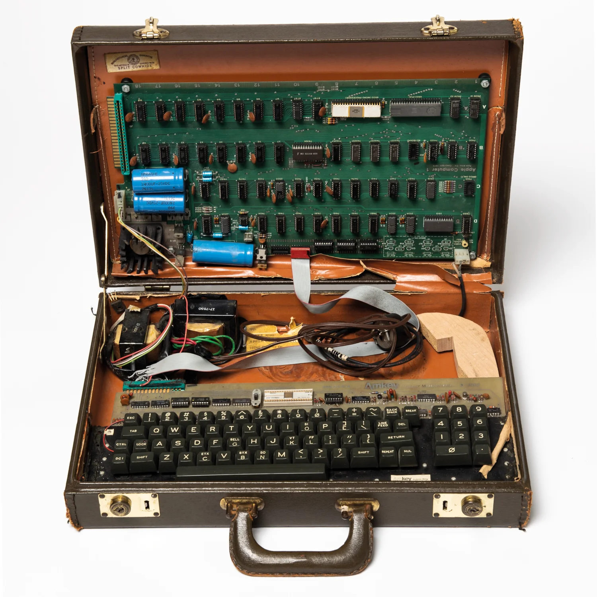
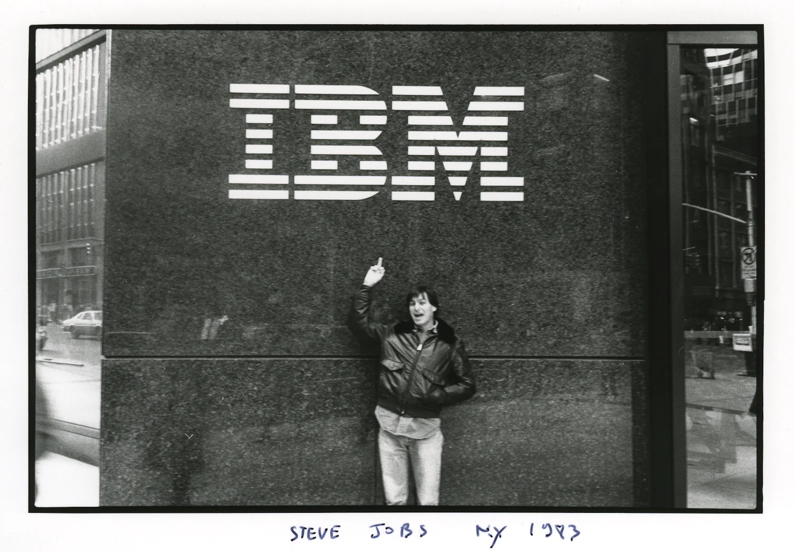
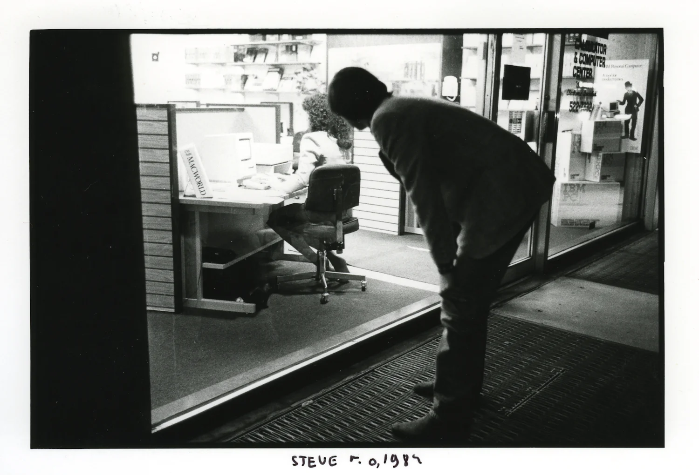
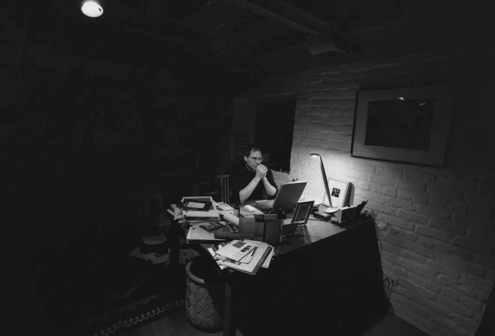
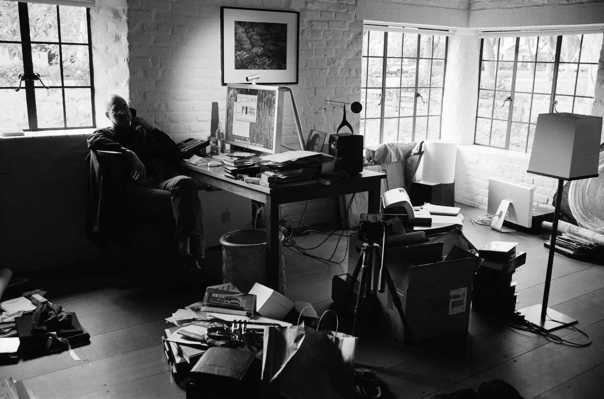
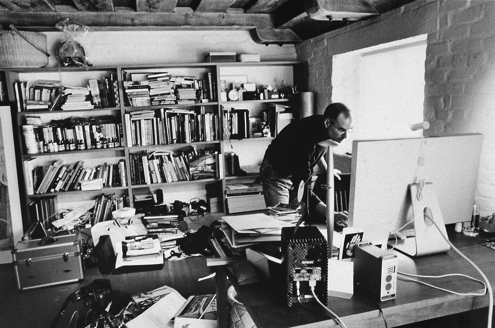
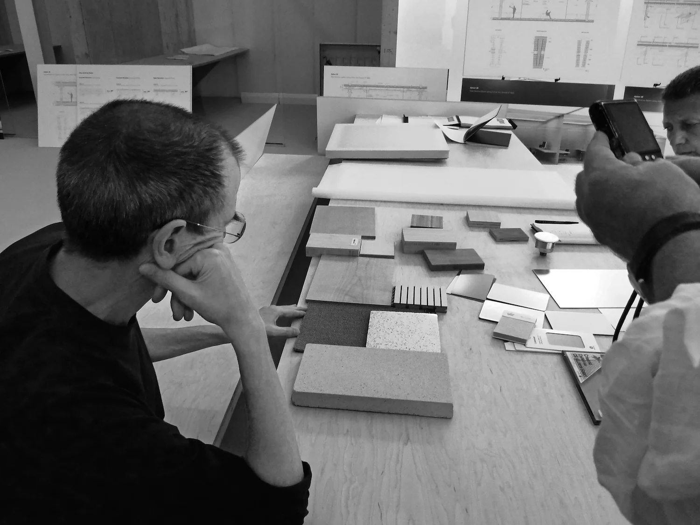
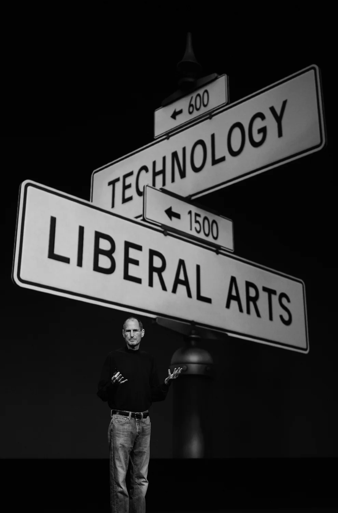

# Признание в любви к людям

    <time datetime="2023-08-23 07:01">23.08.2023 07:01</time>

Есть такой сайт [Steve Jobs Archive](https://book.stevejobsarchive.com/), на котором собраны выступления, письма, фотографии, интервью Стива Джобса на разных этапах его жизни: детство, колледж, основание Эппл, уход из Эппл, работа в Пиксар, возвращение в Эппл. Среди всех этих этапов можно проследить одно важное чувство, которое Стив испытывает: любовь.

Стив учился в Риде — гуманитарном колледже. После того, как он формально отчислился из него, он стал посещать занятия, которые казались ему более интересными. Одним из таких была каллиграфия. В одном из своих выступлений он сказал: "Если бы не эти занятия, не было бы той философии Мака, которую мы в него заложили. Философия Мака — дать гикам, компьютерным энтузиастам возможность прикоснуться к прекрасному: к шрифтам, фотографиям; дать технарям доступ к искусству, сделать его либеральным". Это проявление любви: сделать подарок. И Стив сделал такой подарок всем людям: он дал доступ к прекрасному огромной прослойке людей. Впоследствии эта группа людей расширилась до вообще всех: Маки стали использовать не только технари, а не-Маки копировали идеи Эппл и находили свою аудиторию.

Становление Про-линейки устройств — также проявление любви. Стив искренне восхищался великими людьми (и принижал свои достоинства, разумеется). Перед внутренним показом рекламы "Думай иначе" (Think Different) Стив сказал следующее: "... И мы имеем то, что движет мной. Это честь тем людям, что меняют мир. Кто-то из них жив. Кто-то нет. Но те, кто нет, если бы они использовали компьютер, то это был бы Мак". Сама по себе реклама это не призыв "Думать иначе". Это благодарность тем, кто, думая иначе, изменил мир. И для следующих поколений таких "сумасшедших, аутсайдеров, мятежников, выскочек" были созданы Про компьютеры, чтобы они дальше творили ту дичь, что меняет мир.

Во многих интервью и выступлениях Стив часто говорит о том, что Маки — самые простые в настройке устройства. Когда ты делаешь персональный компьютер, который должен быть у каждого человека, ты должен продумать его использование с самого начала. Проявить заботу о каждой мелочи — также проявление любви. Причём к каждому конкретному человеку. До сих пор Эппл является одним из лидеров по технологиям для людей с ограниченными возможностями и это ещё раз подтверждает, что каждый человек ценен.

Возможно, это всё идеализированно и на самом деле всё было сделано ради денег: шрифты для рынка типографов; Про-линейка, чтобы продать то же самое, но дороже; лёгкость использования — враньё и способ привлечь клиентов. Может быть. Скорее всего. *Да 100% так и было*. Но любовь Стива к людям это не умаляет: дать лучшие вещи для сотрудников, клиентов, людей, чтобы они создавали другие ещё более лучшие вещи. 

"Я выращиваю немного еды, которую я ем, и из того, что я выращиваю, я не вывожу и не совершенствую семена.
Я не делаю ничего из моей собственной одежды.
Я говорю на языке, который я не изобрёл совершенствовал.
Я не открыл математику, которую я использую.
Я защищён свободами и законами, о которых я не подозревал, или которые я не издавал, принимал или использовал.
Я движим музыкой, которую я не создал сам.
Когда мне нужно было медицинской внимание, я был беспомощным, чтобы помочь себе выжить.
Я не изобрёл транзистор, микропроцессор, объектно-ориентированное программирование и большинство технологий, с которыми я работаю.
Я люблю и восхищаюсь моими сородичами, живыми и мёртвыми, и я полностью завишу от них в вопросах моей жизни и самочувствия.
Отправлено с моего АйПада."

I grow little of the food I eat, and of the little I do grow I did not breed or perfect the seeds.
I do not make any of my own clothing.
I speak a language I did not invent or refine.
I did not discover the mathematics I use.
I am protected by freedoms and laws I did not conceive of or legislate, and do not enforce or adjudicate.
I am moved by music I did not create myself.
When I needed medical attention, I was helpless to help myself survive.
I did not invent the transistor, the microprocessor, object oriented programming, or most of the technology I work with.
I love and admire my species, living and dead, and am totally dependent on them for my life and well being.
Sent from my iPad

Немного фотографий, которые мне понравились из этого архива:

Поэма другу "Не трать своё время", 1974.

Работа над Эппл 1, 1976.

Эппл 1

Смотрит, как люди пользуются Маком

1997 — возвращение в Эппл.

Домашний офис, 2004 год

[Ещё фото дома](https://www.gettyimages.com/detail/news-photo/and-chairman-of-apple-steve-jobs-at-his-palo-alto-home-for-news-photo/127446751)

Обдумывание дизайна Эппл Парка, 2010.

"Только одних технологий недостаточно". 2011.

___________________

Как пришёл Тим Кук: https://youtu.be/38XMIMrIg_g?si=MLENXAiLjrO2q389

Что сказали про Стива в новостях: "He was an artist who worked in metal and glass. In plastic and pixels"